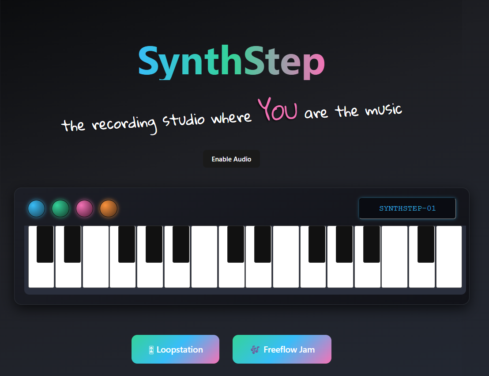

# 🎶 SynthStep

> “Don’t dance to the music — *make the music dance to you.*”

---

## 🌟 Inspiration
For our **ShellHacks 2025** project, we were inspired by the idea of learning and making music in a more **interactive and playful** way.  
Instead of dancing *to* music, we wanted to **reverse the roles**, letting music be **created as you dance**.  
Our goal was to capture the fun of experimentation and make music feel natural, intuitive, and expressive.

---

## 🎧 What It Does
**SynthStep** is an interactive **loop station** that turns **hand and body movements** into music.  

🎵 **Features**
- Real-time **motion-to-sound** mapping using your camera  
- Play multiple instruments: drums, synths, and strings  
- Adjust **pitch** and **volume** with sliders  
- A **Freeflow mode** for a completely hands-free creative experience to just *flow*

---

## 🛠️ How We Built It
We built SynthStep with a combination of **web technologies** and **machine learning tools**:

- **React + Vite** → Frontend interface and UI components  
- **Tone.js** → Real-time sound synthesis and looping  
- **TensorFlow PoseDetection** → Camera-based body tracking  

We mapped detected movement to sound settings like instrument type, pitch, and rhythm. Transforming simple gestures into live musical performances.

---

## 🧩 Challenges We Faced
- Getting **movement detection** and **sound timing** to sync naturally for an intuitive feel
- Implementing **audio recording and loop layering** in the browser  
- Learning **music theory concepts** on the fly, which was ambitious for a 36-hour hackathon!  

---

## 🏆 Accomplishments
- Created a **working prototype** that lets users make music with movement  
- Designed a clean, reactive **UI** for quick interaction  
- Integrated **real-time sound** and **camera-based tracking** for intuitive play  
- Showcased a **hands-free Freeflow mode** where users can “dance to create”

---

## 📚 What We Learned
- Real-time **sound synthesis** and **gesture mapping**  
- Importance of **timing and latency** in interactive music projects  
- Balancing **creativity with technical complexity** under hackathon pressure  

---

## 🚀 What’s Next
- Finalize **looping and recording** features to layer full songs  
- **Refine motion tracking** using a **hand tracker** to interpret signals and gestures, not just wrist movements  
- Add **more instruments and effects** for more creative control  
- Expand **Freeflow mode** to interpret entire **dance sequences**  
- Evolve SynthStep into an **interactive music game** or creative tool for everyone 🎮🎵

---

## 👥 Team
Built with ❤️ at **ShellHacks 2025** by  
**Diego Pedroza** and **Rebecca Osorio**

---